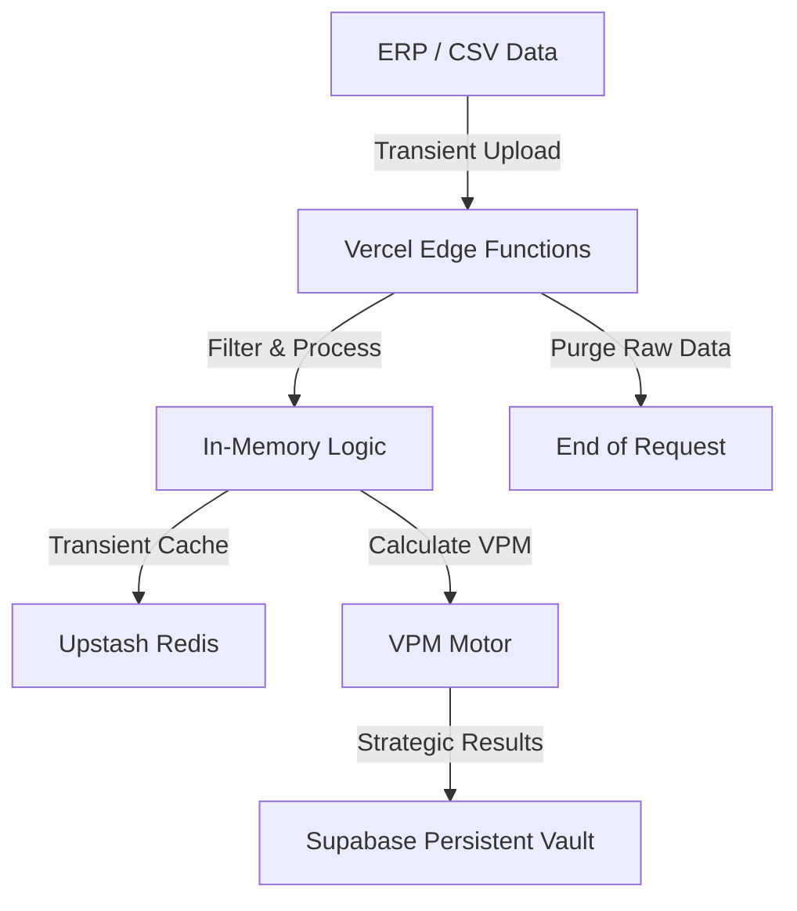

# Technical Architecture: Antigravity (Meta Campo)

Este documento descreve a arquitetura técnica e o fluxo de dados do sistema, focando na metodologia dos 16 passos e na soberania de dados.

## 1. Fluxo de Dados (Memory-First)

## 2. Motor de VPM (Valor de Potencial de Mercado)

O cálculo do VPM é o coração do sistema:
- **Fórmula Base**: `VPM = Área Confirmada (ha) * Valor/ha (por Segmento/Cultura)`.
- **Ajuste de Safra**: O VPM é multiplicado por um fator sazonal baseado no **Calendário Agrícola** (Janelas de Plantio/Colheita).
- **Peso Qualitativo**: No cálculo do Pareto, o faturamento é multiplicado pelo `qualitativeWeight` (Influência do Cliente) para priorização inteligente.

## 3. Metodologia de 16 Passos

A aplicação divide os passos em blocos funcionais:
1.  **Diagnóstico (1-8)**: Foco em materializar a área real e o potencial teórico.
2.  **Consolidação (9-13)**: Foco em aprovação de metas e grau de confiança (4 cores).
3.  **Execução (14-16)**: Planos de visita dinâmicos e proteção de faturamento.

## 4. Estratégia Offline-First

Para CTVs operando em áreas de baixa conectividade:
- **TanStack Query Persistence**: Os dados de check-in e consultas de carteira são cacheados no `localStorage` ou `IndexedDB`.
- **Background Sync**: Sincronização automática assim que a conexão é restaurada.
- **Check-in Leve**: O registro de visita prioriza texto e timestamp para garantir o funcionamento em conexões 2G/EDGE.

---
*Documentação técnica mantida pelo time de Engenharia.*
