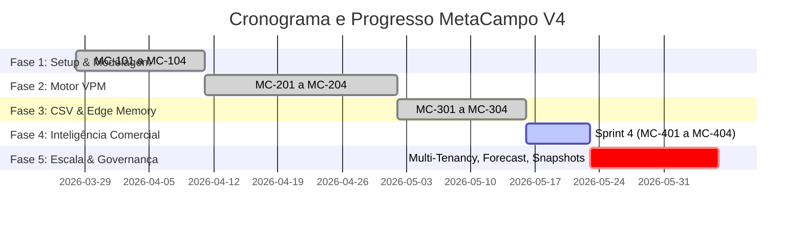

# 📋 Documento Ágil de Status do Projeto — MetaCampo V4

Este documento apresenta o estado de desenvolvimento, a saúde da Sprint e as métricas do motor de Inteligência Comercial e Financeira **MetaCampo / Antigravity V4**. Ele é alinhado com o documento de backlog (`backlog.md`) e serve como painel de acompanhamento para o Product Owner e stakeholders.

---

## 🔍 Visão Geral do Projeto

- **Nome do Projeto:** MetaCampo (Antigravity V4)
- **Objetivo:** Construir uma plataforma de inteligência comercial com processamento *Memory-First* (zero persistência de dados brutos ERP), motor de VPM (Value Potential Mapping) baseado em Wallet Share e painéis de roteamento tático de visitas.
- **Product Owner / Hero:** Daniel (Lead Developer)
- **Data de Início:** 28/03/2026
- **Data Prevista de Homologação:** 05/06/2026 (Semana 10)
- **Status Geral:** 🟡 **Em Execução (Fase 4 – 87% Concluída)**

---

## 🏃‍♂️ Sprint Atual: Sprint 4 (Semana 8 — Finalização de Inteligência Comercial)

Esta Sprint consolidou os recortes analíticos de planejamento e o motor tático de vendas (Pareto, Visitas, Confiança).

| ID | Tipo | Título | Status | Prioridade | Pontos | Início (R) | Fim (R) | Dependências |
| :--- | :--- | :--- | :--- | :---: | :---: | :---: | :---: | :---: |
| **MC-401** | Feature | Workspaces Integrados (5 Visualizações) | **Concluído** | 🔥 Crítica | 13 | 16/05/2026 | 21/05/2026 | MC-302 |
| **MC-402** | Feature | Régua de Confiança & Pareto 4 Pilares | **Concluído** | 🔥 Crítica | 8 | 18/05/2026 | 22/05/2026 | MC-201 |
| **MC-403** | Feature | Motor de Planos de Visitas Automatizados | **Concluído** | ⭐ Alta | 8 | 19/05/2026 | 22/05/2026 | MC-402 |
| **MC-404** | Feature | Refinamento de Interface do Saldo "TO GO" | **Em Andamento**| ⭐ Alta | 5 | 22/05/2026 | — | MC-401 |

### 📊 Resumo de Entrega da Sprint
- **Velocidade Planejada:** 34 pontos
- **Progresso Atual:** 29 pontos entregues (≈ 85%)
- **Status do Burndown:** Em linha com a meta. A única pendência é o polimento final da interface do Saldo "TO GO" na UI (MC-404).

---

## 📈 Histórico e Progresso Acumulado do Projeto

O desenvolvimento do MetaCampo está estruturado em 5 fases sequenciais que mapeiam a evolução técnica do produto.

### Métricas de Progresso
*   **Histórias Concluídas:** 12 de 19
*   **Pontos de História Concluídos:** 89 de 144 (61.8%)
*   **Velocidade Média (últimos 3 ciclos):** 28.5 pontos por sprint.

---

## 🩺 Métricas de Saúde do Projeto

- **Qualidade do Código:** Suite de testes de VPM (Golden Master) cobrindo todos os cenários de simulação de carteira com 100% de sucesso.
- **Isolamento de Dados:** RLS (Row-Level Security) habilitado na camada de banco de dados do Supabase. A transição para Multi-Tenancy (Fase 5) blindará o acesso por empresa.
- **Performance de Borda:** Middleware CSV processando datasets de faturamento YTD no Edge Runtime abaixo de 120ms (limite de 1.5s).

---

## ⚠️ Matriz de Riscos & Bloqueios Críticos

| Risco / Bloqueio | Severidade | Impacto | Mitigação / Ação |
| :--- | :---: | :--- | :--- |
| **Upgrade do Tier Vercel** | 🔥 Alta | Vercel Hobby não oferece SLA nem cotas de chamadas suficientes para as Edge Functions de processamento de CSVs grandes. | **AÇÃO:** Efetuar contratação do plano Vercel Pro antes do deploy de homologação na Fase 5. |
| **Limites de Requests Upstash Redis** | 📈 Média | Carteiras massivas com mais de 300 clientes e múltiplos uploads diários de faturamento YTD podem ultrapassar o limite gratuito de 10k req/dia. | **AÇÃO:** Monitorar tráfego na primeira semana de homologação e ativar o plano pay-as-you-go caso necessário. |
| **Débito de Multi-Tenancy retroativo** | 🔥 Alta | O roadmap coloca onboarding na Fase 5, mas implantar `tenant_id` após o deploy em produção exigiria migrações de risco extremo. | **AÇÃO:** Mapear `tenant_id` no schema de dados imediatamente nas tarefas MC-501, MC-502 e MC-503. |

---

## 🗓️ Planejamento da Próxima Sprint: Sprint 5 (Semana 9 — Escala, Governança & Multi-Tenancy)

A Sprint 5 focará na blindagem de isolamento empresarial (Multi-Tenancy) e na estruturação de snapshots para relatórios comparativos YoY (Ano contra Ano).

1.  **MC-501 — Governança Multi-Tenant:** Criar tabela `tenants` e injetar a coluna `tenant_id` em todas as tabelas de negócio, reescrevendo as políticas RLS.
2.  **MC-502 — Forecast Bottom-up:** Criar o schema e tela de previsão de faturamento por cliente (`customer_forecasts`) com validações automáticas contra o `setup_budgets`.
3.  **MC-503 — Snapshots YoY:** Tabela `faturamento_snapshots` registrando os agregados mensais ao fim do pipeline Memory-First.
4.  **MC-404 (Dívida Técnica):** Concluir o polimento fino da interface do Saldo "TO GO".

---

> **Nota:** Este relatório é o retrato fiel das atividades correntes sob o modelo ágil, servindo de base para o fechamento da Fase 4.

*Atualizado em 2026-05-23 por Antigravity AI.*
