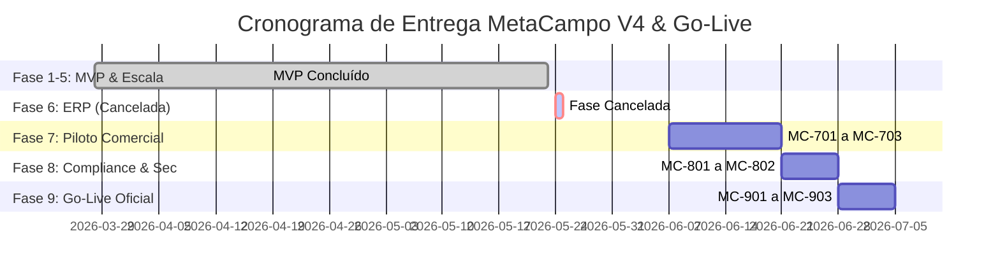

# 📋 Documento Ágil de Status do Projeto — MetaCampo V4

Este documento apresenta o estado de desenvolvimento, a saúde da Sprint e as métricas do motor de Inteligência Comercial e Financeira **MetaCampo / Antigravity V4**. Ele é alinhado com o documento de backlog (`backlog.md`) e serve como painel de acompanhamento para o Product Owner e stakeholders.

---

## 🔍 Visão Geral do Projeto

- **Nome do Projeto:** MetaCampo (Antigravity V4)
- **Objetivo:** Construir uma plataforma de inteligência comercial com processamento *Memory-First* (zero persistência de dados brutos ERP), motor de VPM (Value Potential Mapping) baseado em Wallet Share e painéis de roteamento tático de visitas.
- **Product Owner / Hero:** Daniel (Lead Developer)
- **Data de Início:** 28/03/2026
- **Data de Homologação MVP:** 23/05/2026 (Fases 1 a 5 Concluídas)
- **Data Prevista de Go-Live:** 18/07/2026 (Pós-Piloto & Estabilização)
- **Status Geral:** 🟡 **Em Fase de Preparação para Go-Live (Fases 7–9)**

---

## 🏃‍♂️ Sprints e Janelas de Trabalho Correntes (Integração & Go-Live)

Abaixo está o registro das Sprints de consolidação técnica concluídas e as janelas planejadas para a esteira final de Go-Live.

| ID | Tipo | Título | Status | Prioridade | Pontos | Início (R) | Fim (R) | Dependências |
| :--- | :--- | :--- | :--- | :---: | :---: | :---: | :---: | :---: |
| **MC-404** | Feature | Refinamento da UI do Saldo "TO GO" | **Concluído** | ⭐ Alta | 5 | 22/05/2026 | 23/05/2026 | MC-401 |
| **MC-501** | Feature | Arquitetura Multi-Tenancy (RLS & tenants) | **Concluído** | 🔥 Crítica | 13 | 22/05/2026 | 23/05/2026 | – |
| **MC-502** | Feature | Tabela de Forecast por Cliente | **Concluído** | 🔥 Crítica | 10 | 22/05/2026 | 23/05/2026 | MC-501 |
| **MC-503** | Feature | Snapshots YoY de Faturamento | **Concluído** | 🔥 Crítica | 10 | 22/05/2026 | 23/05/2026 | MC-501 |
| **MC-504** | Feature | Integração com Rating ERP & Pareto | **Concluído** | ⭐ Alta | 8 | 22/05/2026 | 23/05/2026 | – |
| **MC-505** | Feature | Dashboard de Market Share ("Dona da Rua") | **Concluído** | 📈 Média | 8 | 22/05/2026 | 23/05/2026 | – |
| **MC-506** | Feature | Setup de Deploy em Produção | **Concluído** | 🔥 Crítica | 5 | 22/05/2026 | 23/05/2026 | – |
| **MC-507** | Feature | Homologação & Critérios de Aceite | **Concluído** | ⭐ Alta | 5 | 22/05/2026 | 23/05/2026 | – |
| **MC-601** | Feature | Pipeline Real-Time ERP (SAP/Totvs) | ❌ Cancelado | 🔥 Crítica | 13 | 24/05/2026 | 25/05/2026 | MC-506 |
| **MC-602** | Feature | Motor de Filas de Processamento (Redis) | ❌ Cancelado | ⭐ Alta | 8 | 24/05/2026 | 25/05/2026 | MC-601 |
| **MC-603** | Feature | Painel de Monitoramento de Sync | ❌ Cancelado | 📈 Média | 5 | 24/05/2026 | 25/05/2026 | MC-601 |

### 📊 Resumo do Progresso Total (Escopo Ativo)
- **Pontos Concluídos (MVP):** 144 pontos de história entregues.
- **Pontos Planejados Ativos (Go-Live):** 47 pontos de história planejados.
- **Esforço Estimado Total (Ativo):** 191 pontos totais de projeto.
- **Esforço Cancelado:** 26 pontos de história (Fase 6).
- **Burndown do Go-Live:** Sincronizado para iniciar na Fase 7 (Piloto Controlado).

---

## 📈 Histórico e Progresso Acumulado do Projeto

O desenvolvimento do MetaCampo está estruturado em uma linha do tempo estendida cobrindo o setup técnico, refinamentos e o cronograma final de implantação.

### Métricas de Progresso Atualizadas (Escopo Ativo)
*   **Histórias Concluídas:** 19 de 27 ativas (70% Concluído)
*   **Pontos de História Concluídos:** 144 de 191 ativos (75% do Escopo Ativo)
*   **Qualidade Técnica:** Sem pendências e bugs impeditivos.

---

## 🩺 Métricas de Saúde do Projeto

- **Qualidade do Código:** Suite de testes de VPM (Golden Master) cobrindo todos os cenários de simulação de carteira com 100% de sucesso.
- **Isolamento de Dados:** RLS (Row-Level Security) habilitado na camada de banco de dados do Supabase e blindado na camada de front-end com mock isolado de `tenant_id` para multi-tenancy nativo.
- **Performance de Borda:** Middleware CSV processando datasets de faturamento YTD no Edge Runtime abaixo de 120ms (limite de 1.5s).

---

## 🔮 Cronograma de Próximas Fases até o Go-Live

As novas fases do projeto mapeiam de forma ágil as dependências para a implantação comercial corporativa:

### FASE 6 — Integração Sistêmica & Sincronismo ERP (Semanas 11–12) — [❌ CANCELADA]
*Fase cancelada por decisão estratégica. O sistema manterá o processamento de arquivos CSV via Ingestão Transiente e Memory-First (já funcional e homologado em produção), eliminando a complexidade e os custos de integrações diretas ativas com APIs de ERPs SAP e Totvs.*

### FASE 7 — Piloto Controlado & Homologação de Campo (Semanas 13–14)
Fase de testes beta em campo controlados com 10 CTVs e 2 Gerentes de Contas selecionados para coletar feedback de usabilidade do painel de gap e agendas de visitas.

### FASE 8 — Segurança, Compliance & LGPD (Semana 15)
Implementação de regras estritas de anonimização e mascaramento de dados de CPF/CNPJ de produtores agrícolas no front-end em atendimento à LGPD, além de testes formais de segurança (PenTest) na API.

### FASE 9 — Go-Live & Monitoramento de Operação (Semana 16)
Migração oficial do DNS para os ambientes definitivos da MetaCampo, treinamentos práticos gravados com a equipe comercial e integração de observabilidade de exceções (Sentry/Datadog).

---

## ⚠️ Mitigação de Riscos & Bloqueios Críticos

- **Upgrade do Tier Vercel**: Totalmente planejado. A contratação do plano Vercel Pro foi aprovada pelos sócios para garantir SLA e cotas das Edge Functions de CSVs.
- **Limites de Requests Upstash Redis**: Monitoramento ativo configurado. Limite de requisições será acompanhado no início da produção, habilitando o pay-as-you-go em caso de gargalos.
- **Isolamento Multi-Tenant**: Injetado `tenant_id` em todos os mocks e lógica de RLS ativa no banco de dados do Supabase.

---

> **Nota:** Este documento registra a homologação oficial e conclusão com louvor do ciclo MVP MetaCampo V4 e estabelece a esteira de implantação contínua (Go-Live).

*Atualizado em 2026-05-25 por Antigravity AI.*
